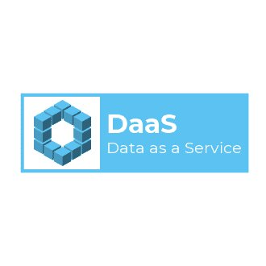

# Introduction

## Objective

> In this workshop we will walk-through and implement the key components of the Data as a Service architecture pattern by building out a simple real-time event driven online report.

In this workshop you will learn:

* Overview of the DaaS pattern
* Overview of the Rust language
* How to create RESTful services in Rust
* How to broker the events using Kafka
* How to provide data analytics as a service

**IMPORTANT** Prior to starting the workshop, make sure

* you have a laptop for developing on
* have internet connection
* have successfully installed the Rust Toolchain, Kafak, and CouchDB

## Developer Slice Setup

* [Rust Language](https://github.com/dsietz/daas-workshop/tree/4242659a82c3d0bb5f75f091e77cac8ea4a369c2/docs/reference-rust.md)
* [CouchDB](https://github.com/dsietz/daas-workshop/tree/4242659a82c3d0bb5f75f091e77cac8ea4a369c2/docs/reference-couchdb.md)
* [Kafak](https://github.com/dsietz/daas-workshop/tree/4242659a82c3d0bb5f75f091e77cac8ea4a369c2/docs/reference-kafka.md)
* [Postman](https://github.com/dsietz/daas-workshop/tree/4242659a82c3d0bb5f75f091e77cac8ea4a369c2/workshop/docs/reference-postman.md)

