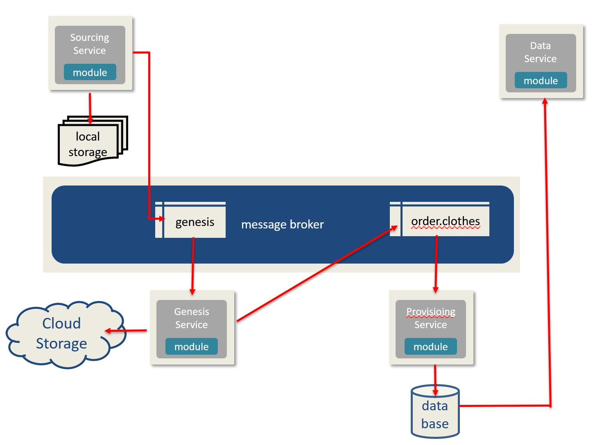

# Section I - The Overall Pattern

The DaaS architecture provides the agility to scale and adapt the sourcing, provisioning, and publishing of data using a combination of the microservice pattern and plugin model.

* By sourcing the data through an adaptive layer, we are able to loosely couple our data source from the provisioning. 
* Using an eventing model removes the process dependency of the data records \(non-bundled\)
* Applying a plugin model provides self-orchestrated workflow as well as the agility to change our provisioning with the least amount of impact
* Placing a service-based layer between the data consumers and the provisioned data, provides the flexibility to support consumer based contracts \(e.g.: security, error handling, scope of data set\) 

