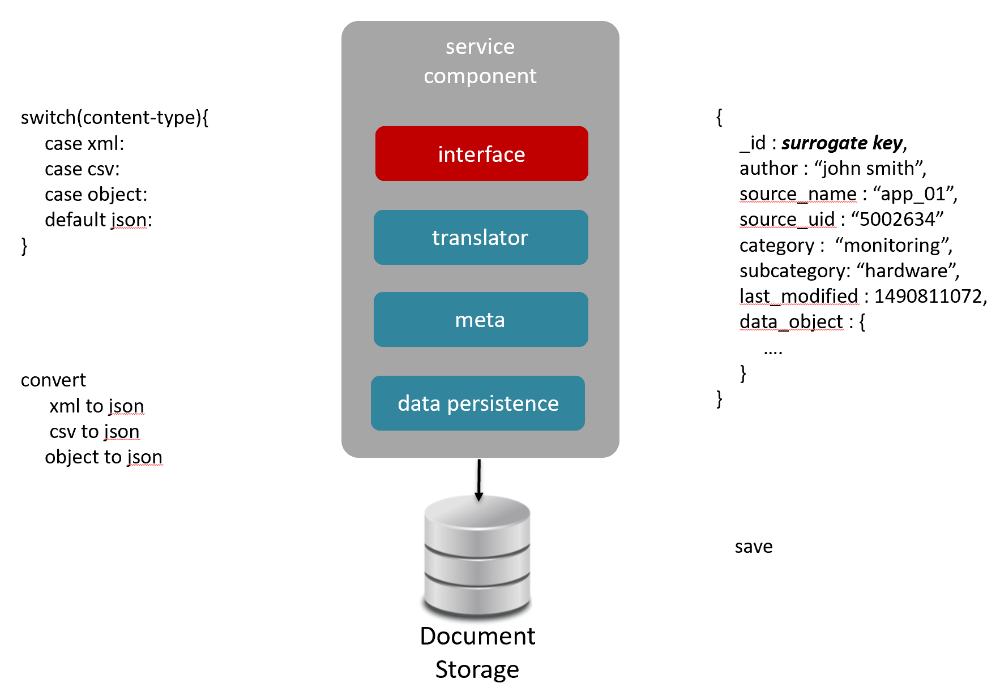

# Section II - Data Sourcing

In order to support real-time provisioning we first need to support real-time sourcing. To do this, we use a RESTful endpoint that is designed to ...

1. be autonomous to the schema of the data being sourced
2. dynamically construct meta data based on the source of the data
3. ensure delivery of the sourced data to the provisioning engine

