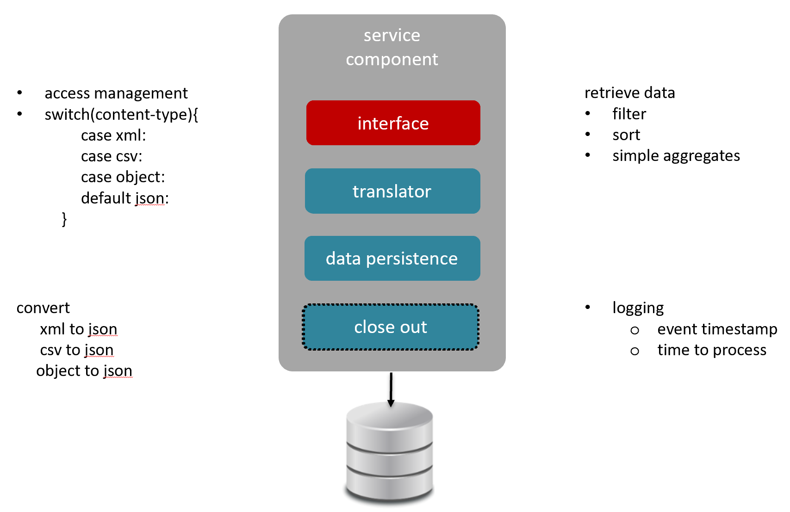

# Section IV - Data Consumption

Just like the provisioning of the data, the "how and what" of the consumption is never static. The connection method \(e.g.: web service, database connection, client\), scope of the data, and applied criteria \(e.g.: security, filters, formats\) require flexibility of the architecture with shortened Mean Time To Deliver \(MTTD\).

