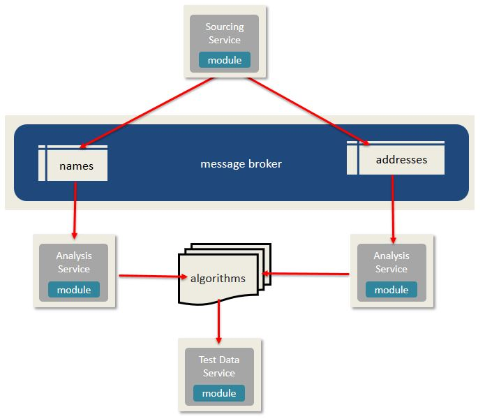

# Section V - Test Data Platform

To build a Test Data Generation platform, we will need to provide a way to: 

* broker `sample data` in real-time from the data source \(Kafka\)
* analyze the data and update the profiles \(AKA algorithms\)
* stand up a eb service that will use the profiles to generate test data on demand

To simply the development of our Test Data Generation platform, we will be using the [Test Data Generation](https://crates.io/crates/test-data-generation) library and [PbD SDK](https://crates.io/crates/pbd).

