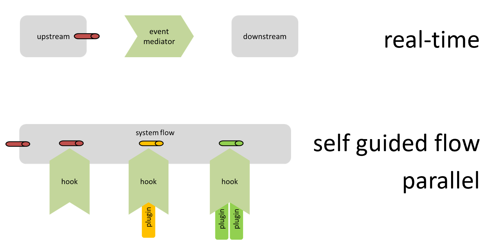

# Section V - Test Data Generation Platform

To build a Test Data Generation platform, we will need to provide a way to: 

* broker `sample data` in real-time from the data source \(Kafka\)
* analyze the data and update the profiles \(AKA algorithms\)
* stand up a eb service that will use the profiles to generate test data on demand

Provisioning logic will be forever changing, so we need to ...

1. ensure that process is not brittle
2. the workflow is self-guided
3. data records are not bundled

To simply the development of our Test Data Generation platform, we will be using the [Test Data Generation](https://crates.io/crates/test-data-generation) library, [PbD ](https://crates.io/crates/pbd)and [DaaS ](https://crates.io/crates/daas)SDKs.

