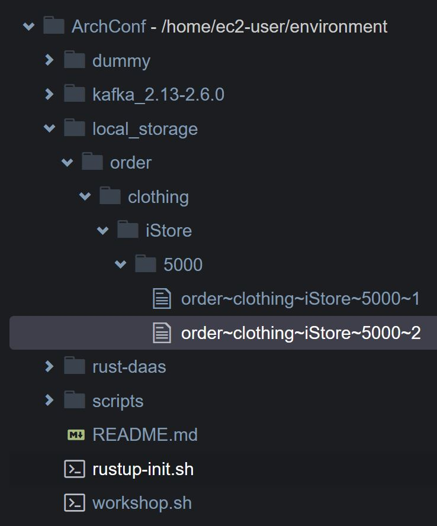

# Section V - service testing

A very powerful feature of the `actix-web` crate is the built in service testing that comes out-of-the-box. We utilized this feature in `web-service-tests.rs` as part of our integrated testing.

However, we don't need to test the code for the service modules since they have already been tested in the SDKs. Instead, we will smoke test the the RESTful service is working correctly by using the `curl` command.

> NOTE: The service should already be running since we had started it in the prior section.

Run the following script.

> NOTE: Make sure you are in the environment directory. `cd $HOME/environment`

```text
./scripts/curl-sourcing.sh
```

The response payload should be the following:

```javascript
{
    "status": "OK"
}
```

## Kafka genesis Topic

> TIP: You can verify that the data was converted to a DaaSDocument and sent to the Kafka broker by running a Kafka consumer and monitoring the `genesis` topic. We recommend using a new terminal.

```text
./kafka_2.13-2.6.0/bin/kafka-console-consumer.sh --bootstrap-server localhost:9092 --topic genesis --from-beginning
```

```javascript
{
   "_id":"order~clothing~iStore~5000",
   "_rev":"4",
   "source_name":"iStore",
   "source_uid":5000,
   "category":"order",
   "subcategory":"clothing",
   "author":"istore_app",
   "process_ind":false,
   "last_updated":1604259792,
   "data_usage_agreements":[
      {
         "agreement_name":"billing",
         "location":"www.dua.org/billing.pdf",
         "agreed_dtm":1553988607
      }
   ],
   "data_tracker":{
      "chain":[
         {
            "identifier":{
               "data_id":"order~clothing~iStore~5000",
               "index":0,
               "timestamp":0,
               "actor_id":"",
               "previous_hash":"0"
            },
            "hash":"72259503327276020952102368672148358485",
            "nonce":5
         }
      ]
   },
   "meta_data":{
      "content-type":"application/json"
   },
   "tags":[

   ],
   "data_obj":[
      123,
      10,
      9,
      34,
      113,
      117,
      97,
      110,
      116,
      105,
      116,
      121,
      34,
      58,
      32,
      49,
      44,
      10,
      9,
      34,
      115,
      116,
      97,
      116,
      117,
      115,
      34,
      58,
      34,
      110,
      101,
      119,
      34,
      10,
      125
   ]
}
```

## Local Storage

Since the DaaS pattern is meant to be a loosely coupled architecture and built-in support of a distributed model, the `DaaSListener` automatically stores a copy of the DaaSDocument in local storage in case the broker is not available and the records need to be rerun at a later time.

After the first call has been made to the sourcing RESTful service, a directory named `local_storage` till have been created in the main path, \(in this case `ArchConfWorkshopUser:~/environment`\).



