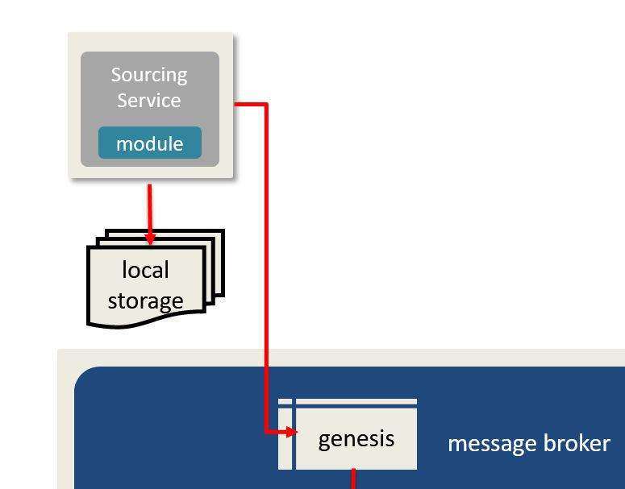

# Section I - Overview

Before we begin constructing our first RESTful service for the DaaS Pattern, we need to first review the architecture overview of the DaaS Pattern. We see in the pattern that our DaaS services interact with:

* **microservices** using persistant data storage, \(we will be using local storage and a S3 bucket\) 
* a **broker** \(we will be using Kafka\)
* a **data pattern**, \(a metadata data model\) 

Together, these components allow the DaaS Pattern to become a reactive architecture.

Based on these system interactions, and applying Object Oriented Design, we quickly realize that there needs to be multiple `modules` in our library to stand up a DaaS platform.

Fortunately, we won't need to build these `modules`.  The [DaaS](https://crates.io/crates/daas) SDK provides the underlying _object wrappers,_ _data model_ support, and implement common _privacy strategies_ covered  [Privacy by Design](https://crates.io/crates/pbd).

