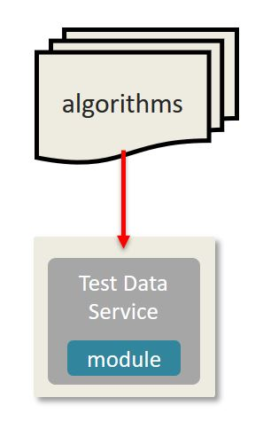

# Module IV - Modifying the RESTful Endpoint

In this module, we will be changing the RESTful endpoint to take Resource Path parameters to specify the type of test data we wish to generate, \(e.g.: names\)

