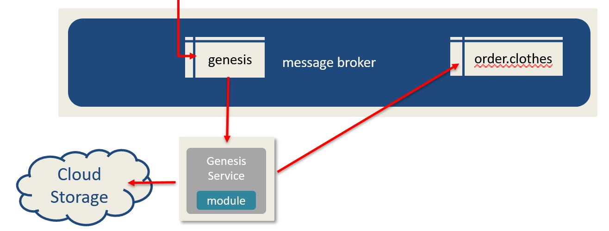

# Section I - Overview

The genesis microservice is the keeper of the original data. It listens to the `genesis` topic and stores the DaaSDocument as it was sourced in a AWS S3 Bucket. \(The DaaS SDK also has the option for using a CouchDB as the data storage engine.\) By making this the first step in the provisioning process, we can ensure that the data can be reprocessed should the downstream services and the data sources fail.

