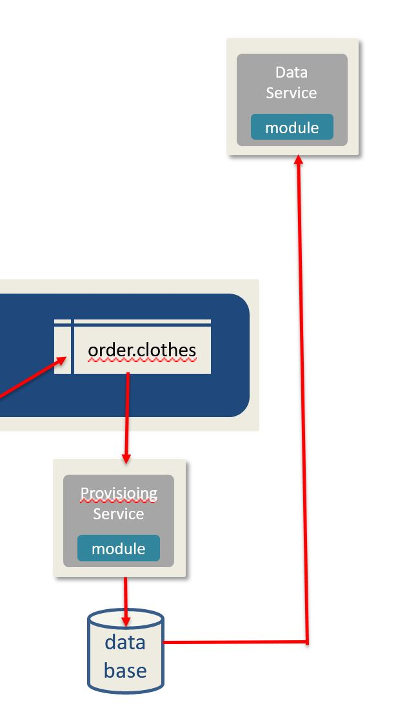

# Section I - Overview

> What good is knowing something if you do not share it?

We have built out the basic building blocks of a DaaS platform: Sourcing, Genesis, Provisioning. We are now ready to stand up a RESTful endpoint that wil act as a data source for the presentation layer.

