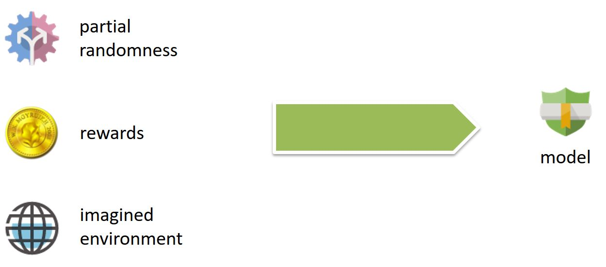
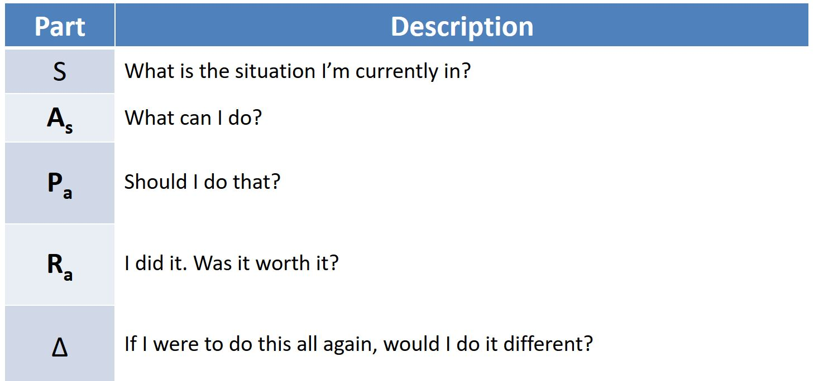
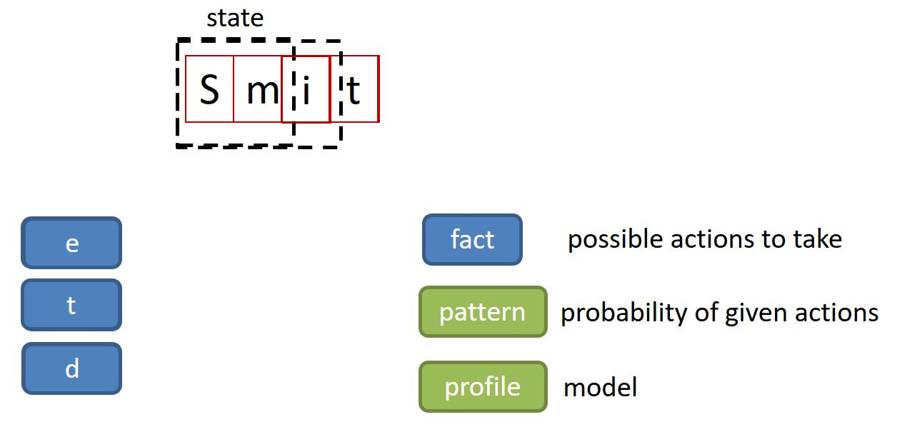
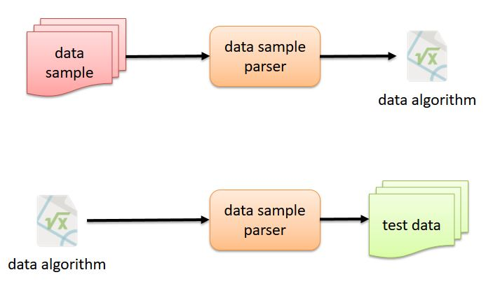

# Section I - Markov Decision Process

In the late 19th century, the Markov Decision Process \(MDP\) was introduced as a mathematical framework for building decision making models.

The MDP can be applied to programmatically build a realistic last name of a person.

By applying the MDP, we can analyze a data sample and build an algorithm that we can reuse to build test data.

