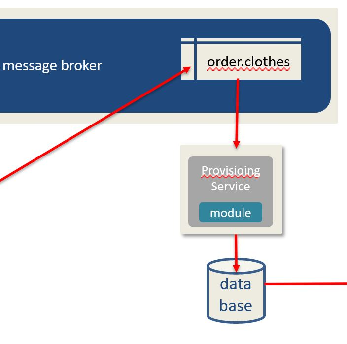

# Section I - Overview

Data provisioning is a core building-block of the DaaS Pattern. It is the implementation of the applications business logic in the data flow of the system. 

To assist developers in building out data provisioning microservices more easily, the DaaS SDk provides a `DaaSProcessor` structure which inherits the `DaaSProcessorService` trait:

* keep\_listening
* start\_listening
* stop\_listening

