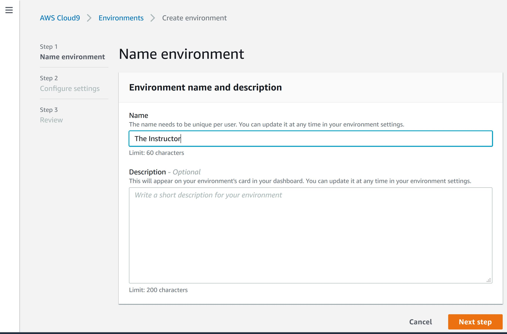
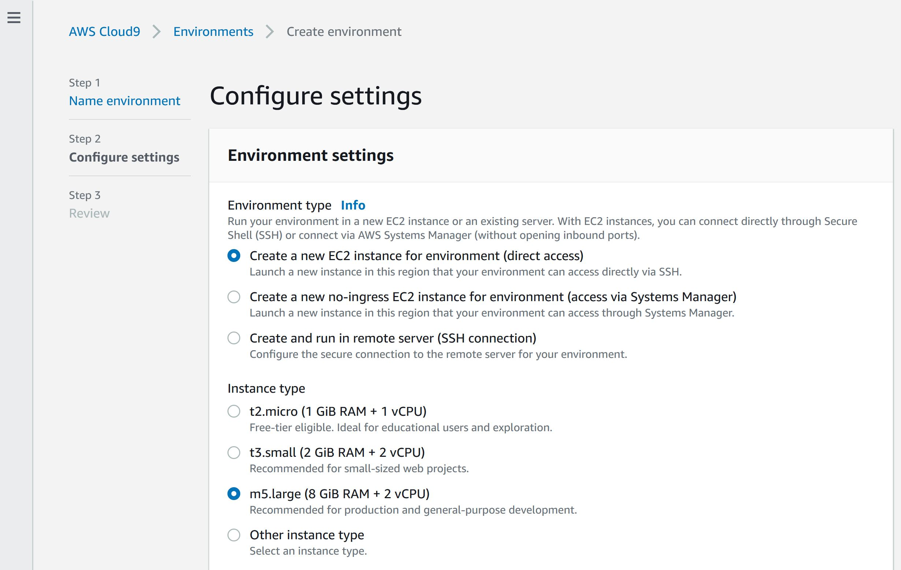
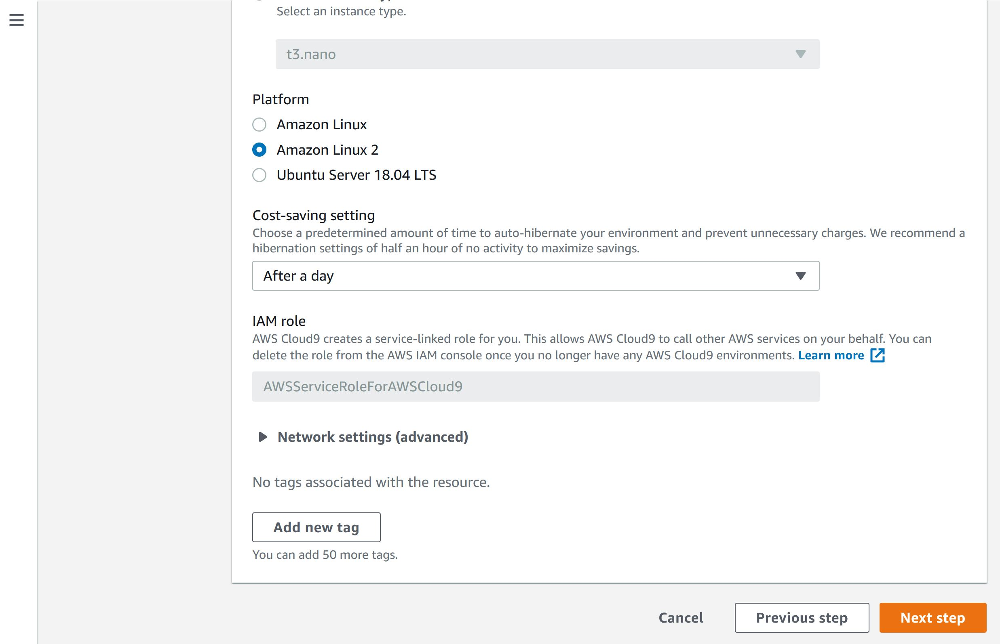
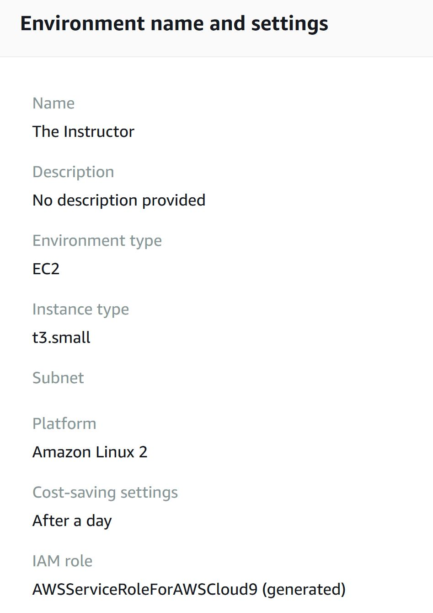
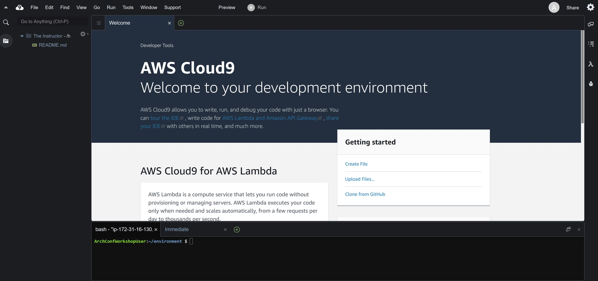

# Creating a Workstation


virtual workstations kindly hosted by [IAPP.org](https://iapp.org/)


First login to the AWS Console. Open your browser and navigate to teh AWS Cloud9 Product page:

[https://us-east-2.console.aws.amazon.com/cloud9/home/product](https://us-east-2.console.aws.amazon.com/cloud9/home/product)

> NOTE: Your instructor will provide you with the login information.
>
> IMPORTANT - Make sure you are in the `US East N. Virginia (us-east-1)` region

Click on the `Create Environment` button

### Step 1

Enter your name as the `Name` of the new environment. 

> NOTE: Do not use the Name `The Instructor`

### Step 2

Select the following:

* Environment type: `Create a new EC2 instance for environment (direct access)`
* Instance type: `m5.large`
* Platform: `Amazon Linux2`
* Cost-saving setting: `After a day`

Click `Next step`

### Step 3

Your review pafge should look like this \(with your own name as the `Name`\)

Click `Create environment`

After your environment is created, you should in your virtual workspace.

